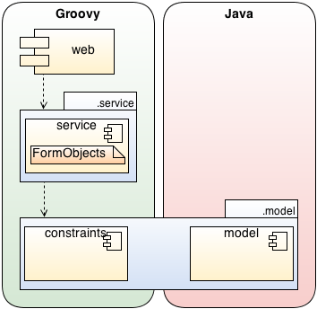

# Polyglot programming web project with Groovy using Grails framework and Java legacy domain model #

This example application consist of a small domain model with only simple business logic to add, remove and list departments and employees. This reference implementation serves as proof of concept to demonstrate the feasibility behind polyglot programming and polyglot programming pyramid. Simplicity of the application limits its ability to demonstrate some cases where different programming languages and paradigms might prove useful. This proof of concept is given to verify that the concept has the potential of being used.

## Project Structure ##

Groovy project benefits from the convention over configuration provided by the Grails framework by using the built-in Grails dependency resolution DSL.

The project structure follows the principles of the four layer architecture of a simple web application, although the repository layer is omitted as it is included in the service layer. Domain model represent the real-world problem, service provides the data access abstraction and implements the business logic, whereas web module binds the whole application to the web environment.

Polyglot programming pyramid specifies the programming languages, frameworks and libraries used in the project. Groovy is the programming language of choice in this project and is located in the stable layer. Grails is a project to extend Groovy to web application development. It provides a fully fledged agile web development environment built upon existing technologies like Spring Framework and Hibernate leveraging the features of Groovy. Having principles like convention over configuration, Grails strives for quick and simple development with less configuration providing many common features out of the box. Grails is an essential part of a web application contributing to all layers, although foremost to the dynamic layer by providing very versatile web application development framework.

The domain layer contains different technologies targeting certain and concrete problem domains. Technologies located in the domain layer are usually utilized inside the other two layers to provide problem domain specific solutions. Grails provides its own object-relational mapping (GORM) build on top of Hibernate to implement data access on domain classes. This project uses the Hibernate and JPA annotated Java legacy domain model implementation from another Java project in conjunction with the Groovy project.

The web module contains web application specific components implemented on top of the Grails framework and also the HTML view layer implemented with GSP. SitemeMesh is used as a decoration framework to wrap additional data around a regular view, Twitter Bootstrap is used to enhance the content presentation and jQuery is utilized to provide dynamic features on the client-side.

### The MIT License (MIT) ###

Copyright (c) 2013 Juhana Harmanen

Permission is hereby granted, free of charge, to any person obtaining a copy of
this software and associated documentation files (the "Software"), to deal in
the Software without restriction, including without limitation the rights to
use, copy, modify, merge, publish, distribute, sublicense, and/or sell copies of
the Software, and to permit persons to whom the Software is furnished to do so,
subject to the following conditions:

The above copyright notice and this permission notice shall be included in all
copies or substantial portions of the Software.

THE SOFTWARE IS PROVIDED "AS IS", WITHOUT WARRANTY OF ANY KIND, EXPRESS OR
IMPLIED, INCLUDING BUT NOT LIMITED TO THE WARRANTIES OF MERCHANTABILITY, FITNESS
FOR A PARTICULAR PURPOSE AND NONINFRINGEMENT. IN NO EVENT SHALL THE AUTHORS OR
COPYRIGHT HOLDERS BE LIABLE FOR ANY CLAIM, DAMAGES OR OTHER LIABILITY, WHETHER
IN AN ACTION OF CONTRACT, TORT OR OTHERWISE, ARISING FROM, OUT OF OR IN
CONNECTION WITH THE SOFTWARE OR THE USE OR OTHER DEALINGS IN THE SOFTWARE.

